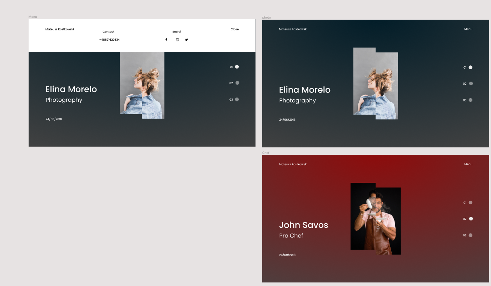
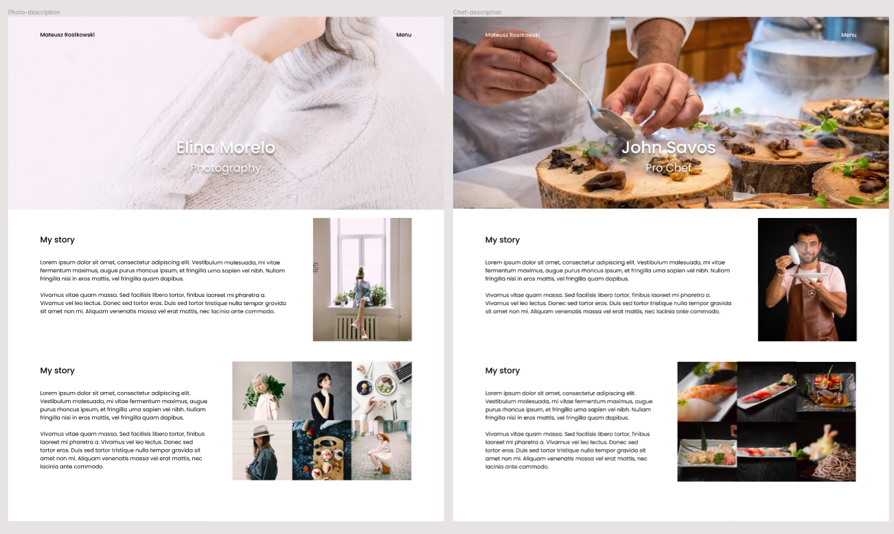

<!-- # Photography-site - portfolio site

Simple portfolio site created with Figma, HTML, CSS, Javascript

#General Info

#Technologies

#Setup -->

# Photography-site - portfolio site
Simple portfolio site created with Figma, HTML, CSS, Javascript

## Table of contents
* [General info](#general-info)
* [Screenshots from figma](#Screenshots-from-figma)
* [Technologies](#technologies)
* [Setup](#setup)
* [Status](#status)
* [Inspiration](#inspiration)
* [Contact](#contact)

## General info
The project was created with [Dev Ed](https://www.youtube.com/channel/UClb90NQQcskPUGDIXsQEz5Q)

## Screenshots from figma
Not all elements are shown on the screenshots

## Technologies
* Figma - on Linux Ubuntu 18.04
* HTML
* CSS
* Javascript

## Setup
Pull the repository to yor PC and open index.html in browser

<!-- ## Features
List of features ready and TODOs for future development
* Awesome feature 1
* Awesome feature 2
* Awesome feature 3

To-do list:
* Wow improvement to be done 1
* Wow improvement to be done 2 -->

## Status
In progress, javascript, left to add interactions to the site using javascript

## Contact
Created by [Mateusz Rostkowski](https://github.com/MateuszRostkowski) - feel free to contact on:
You can find me also on:
* [Linkedin](https://www.linkedin.com/in/mateusz-rostkowski-a20b6518a/)
* [Github](https://github.com/MateuszRostkowski)
